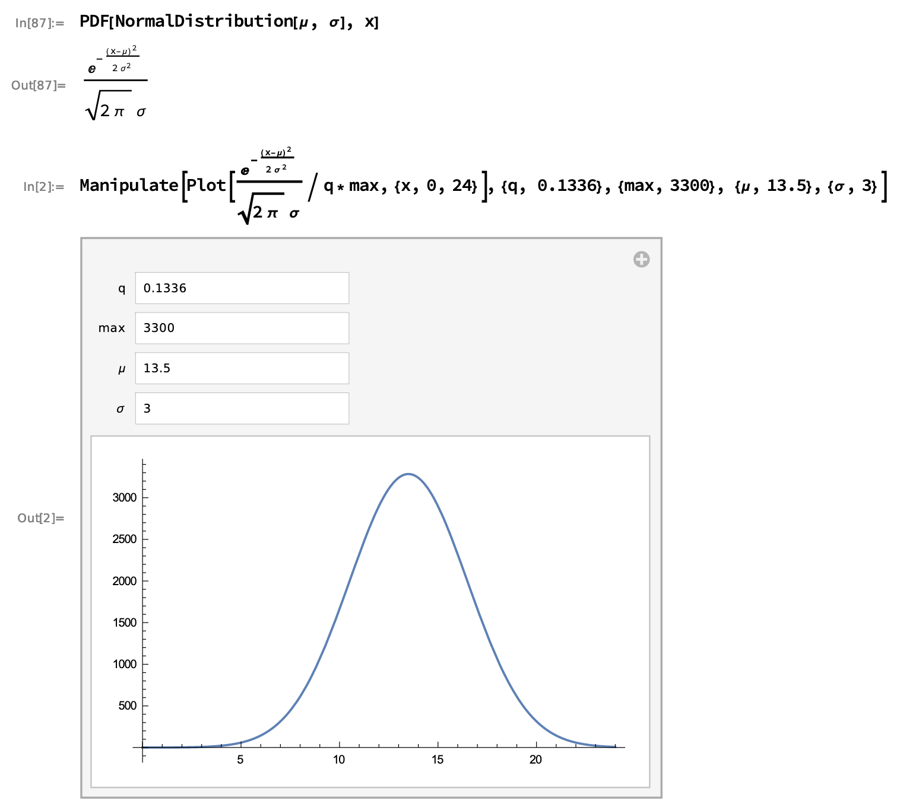
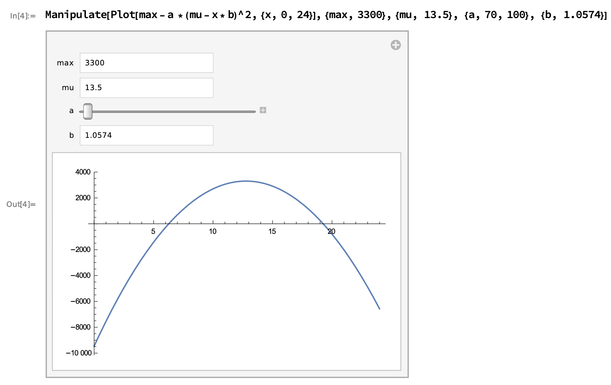

# PV Simulator

## Task
To build an application which generates simulated PV (photovoltaic) power values (in kW)

### Simulator function approximation
The picture of a real PV power output curve during a normal day is given as input.

Apparently we have to approximate the function and use it for the simulation.

Looking at visual representation I had two hypothesis:
1. First (and apparently chosen at the end) impression is that it looks like Gaussian Kernel
2. The first option above is too cuspidal (arrow-headed peak). Next best option was inverted parabola.

The analytical investigation and mathematical experiments in Wolfram Alpha and then Wolfram Cloud resulted in such approximation formulas:
1. Gaussian curve

2. Inverted parabola curve


#### Mathematical notes
The notes are available as [Wolfram Cloud notebook](https://www.wolframcloud.com/obj/13406c33-e24d-433b-89bf-a25c91523a9d).

The notebook [source code](https://www.wolframcloud.com/env/for.key/normpdf.nb).

To ease access it was exported to pdf [online](https://www.wolframcloud.com/pdf/d369b39dc4094799a1e20dc84120b9a1) and [locally](FunctionApproximationByWolframCloud.pdf)

#### Python representation
1. Gaussian curve
```python
    x = np.arange(0, 24, step, float)
    y = max_value * 1/(sigma * np.sqrt(2 * np.pi)*0.1336) \
        * np.exp(- (x - mu)**2 / (2 * sigma**2))
```
2. Inverted parabola curve
```python
    x = np.arange(0, 24, step, float)
    y = max_value - 70 * (mu - x * 1.0574) ** 2
```

After several experiments I gave preference to Gaussian combined with two simple lines (left and right endings) to cut the Gaussian long tails.

## Repository structure
### demo_rabbit folder
#### Two Python scripts
This folder contains two simple Python scripts to demonstrate RabbitMQ functionality. This is an excellent way to check that RabbitMQ is deployed (via Docker, more and that in another section) with proper credentials and proper version and configuration (very close to default one).

In order to run those two Python scripts (and others in this repository) please ensure your environment has proper dependencies. The simplest way to install the dependencies is to run in local Python Virtual Environment (more on Python install and venv setup in another section) a following command:
```shell script
pip install -r requirements.txt
```

The RabbitMQ demo consists of two parts/processes: `send.py` and `receive.py`.
`send` will (hem, well) ... send test messages and respectively `receive` will receive ones.

#### Four shell scripts
The folder contains four shell (bash) scripts in order to automate RabbitMQ related tasks. Of course the proper environment (Docker, shell, Python and the project dependencies) is assumed. The description and a guide for installation are in other sections.
Please note that scripts will pull RabbitMQ Docker image if it is absent in local Docker setup.

* `rabbit_demo.sh` is entry point to whole demo and will show the whole RabbitMQ demo in this folder by calling other scripts
* `rabbit_start.sh` when run is starting Docker image of proper version (3.8.1) with default user (`user`) and default password (`Munich19`). It setups port mapping (`8080:15672  5672:5672`). First one is to open [RabbitMQ web management console](http://localhost:8080 "RabbitMQ Mgm"). The second port is for accessing the RabbitMQ instance from host (using default port `5672`).
* `rabbit_list.sh` checks that RabbitMQ container is running in local docker instance and shows all `queues` in the local RabbitMQ instance (in Docker container).
* `rabbit_clear.sh` stops and removes RabbitMQ container (and its all data and queues of course).


